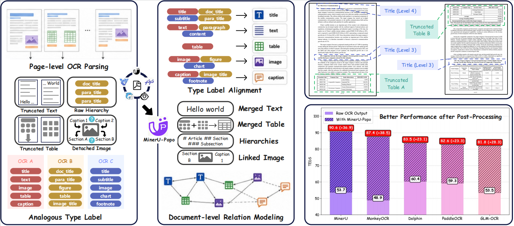
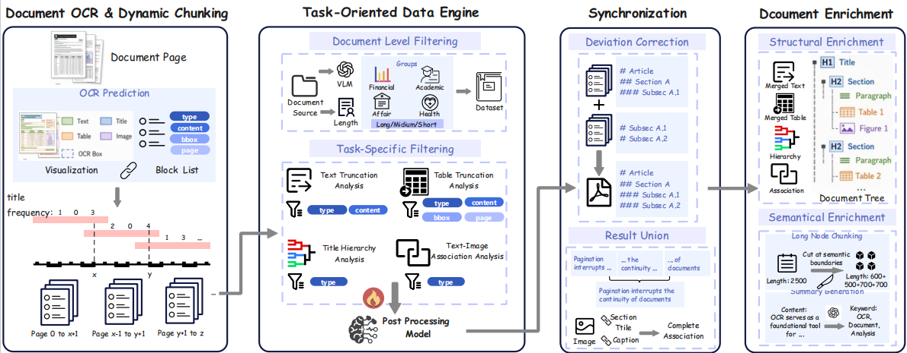

# MinerU-Popo: Universal Post-Processing Model for Structured Document Parsing

<p align="center">
  <a href="http://arxiv.org/abs/2605.24973"></a>
  <a href="https://huggingface.co/DreamEternal/MinerU-Popo"></a>
  <a href="./LICENSE.txt"></a>
</p>

<p align="center">
  <b>如果你喜欢我们的项目，请在 GitHub 上给我们一个星标 ⭐ 以获取最新更新。</b>
</p>

<p align="center">
  📖 <a href="./README.md"><b>English</b></a> &nbsp;|&nbsp; <a href="./README_zh.md"><b>简体中文</b></a>
</p>



## ✨ 引言
**MinerU-Popo** 是一个轻量级、通用的 OCR 输出后处理框架，旨在弥合页面级 OCR 解析与文档级语义结构之间的差距。
它基于一个 4B 的后处理模型构建文档树结构，执行四个子任务：表格截断分析、文本截断分析、标题层级分析以及图文关联分析。我们通过以下方式应对跨页面几何不连续性、冗余文档解析以及长文档可扩展性等挑战：

- **Task-Oriented Data Engine**: 生成具有代表性的训练数据，并简化特定任务的输入形式。
- **Dynamic Chunking and Synchronization**: 动态分块处理长文档，并减少跨块偏差以保持全局一致性。
- **Document Enrichment**: 以树形结构构建文档，生成语义摘要并拆分长章节节点。



## 📊 性能表现

### 后处理得到更优的层级结构 (TEDS)
**Basic OCR** | **Before** | **After**
:---:|:---:|:---:|
 MinerU | 53.7 | **90.6** |
 MonkeyOCR | 48.9 | **87.4** |
 Dolphin | 60.4 | **83.5** |
 PaddleOCR | 59.3 | **82.6** |
 GLM-OCR | 53.5 | **81.8** |

### 相较于直接使用预训练模型的优势
**Model** | **TEDS** | **Doc/s**
:---:|:---:|:---:|
 MinerU-Popo | **90.6** | **0.37** |
 Qwen3-VL-2B | 21.2 | 0.22 |
 Qwen3-VL-4B | 56.5 | 0.20 |
 Qwen3-VL-8B | 65.9 | 0.16 |
 Qwen3-VL-32B | 78.0 | 0.04 |

### 对下游检索分析的提升 (在 ViDoRe V3 上的准确率)
**Method** | **C.S.** | **Fin.** | **H.R.** | **Ind.** | **Phar.**
:---:|:---:|:---:|:---:|:---:|:---:|
 MinerU-Popo | **84.4** | 49.5 | **66.8** | 58.7 | **71.6**
 Raw RAG | 82.3 | 48.7 | 63.2 | **60.4** | 64.4
 Visual RAG | 80.7 | **58.4** | 64.8 | 59.7 | 67.6

## ⚙️ 安装

1. 准备环境
```bash
conda create -n popo python=3.10
conda activate popo
pip install -r requirements.txt
```

2. 下载模型

下载 MinerU-Popo 后处理模型：

```bash
hf download DreamEternal/MinerU-Popo --local-dir models/MinerU-Popo
```

- [MinerU-Popo](https://huggingface.co/DreamEternal/MinerU-Popo)

1. 模型配置

在 [Configuration](./post_processing/model_utils.py) 中，
对于 transformer 推理，请编辑环境变量 `POPO_MODEL_PATH`。对于 vllm 推理，请编辑函数`popo_generate`中的变量 `url` 和 `key`。

对于文档内容丰富化和问答，请进一步编辑函数 `qwen_generate` 和 `gpt_generate` 中的变量 `url` 和 `key`。

## 💻 使用

后处理流程会读取页面级 OCR/Layout 解析结果，将不同模型的输出归一化为统一格式，运行 MinerU-Popo 推理，并最终构建文档树。

### Step 1: 准备 OCR/Layout 输出

先运行页面级解析模型，例如 MinerU、MonkeyOCR、Dolphin、PaddleOCR-VL 或 GLM-OCR。将每个模型的输出放到：

```text
post-process/<model_name>/
```

例如：

```text
post-process/mineru/
post-process/monkeyocr/
post-process/PaddleOCR-VL-1.5/
post-process/dolphin/
post-process/glm-ocr/
```

### Step 2: 归一化标签

将不同模型的原始格式转换为 MinerU-Popo 的统一输入格式：

```bash
bash scripts/run_label_normalization.sh
```

归一化结果会写入：

```text
outputs/label_normalization/<model_name>/
```

### Step 3: 运行 MinerU-Popo 推理

基于归一化后的标签运行 MinerU-Popo：

```bash
bash scripts/run_inference.sh
```

推理结果会写入：

```text
outputs/inference/<model_name>/
```

### Step 4: 构建文档树

从推理结果构建结构化文档树：

```bash
bash scripts/build_tree.sh
```

最终树结构和文本预览会写入：

```text
outputs/build_tree/<model_name>/
outputs/build_tree_txt/<model_name>/
```

树结构输出示例可参考：

```text
output_cases/
```

## 🙏 致谢
- [MinerU](https://github.com/opendatalab/MinerU) 及其他 OCR 系统（MonkeyOCR、Dolphin、PaddleOCR、GLM-OCR）提供的页面级解析能力。
- [ViDoRe V3](https://huggingface.co/datasets/vidore/vidore-benchmark-v3) 和 [MMDA](https://huggingface.co/datasets/DreamEternal/MMDA_Bench) 作为评测基准。

## 📄 许可证
本项目采用 MIT 许可证。详见 [LICENSE](./LICENSE)。
